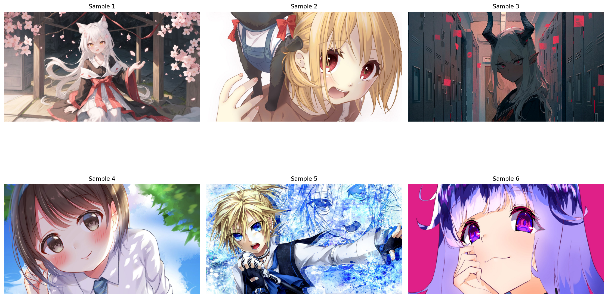
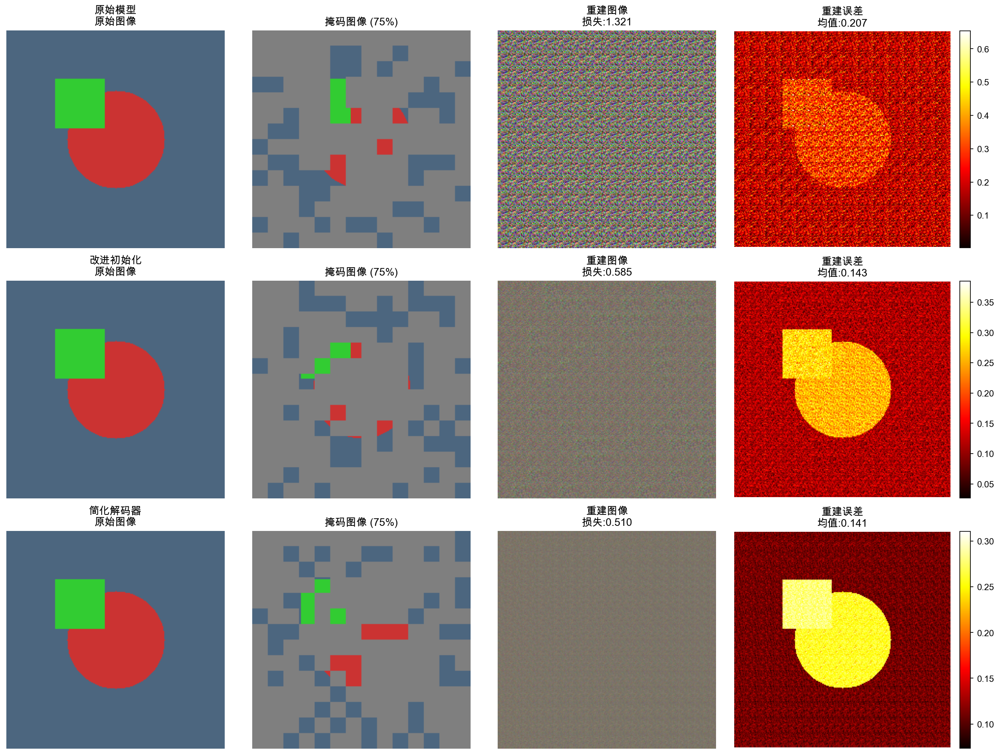

# AniMask
## Anime-Informed Masking for Masked Autoencoders

Team: Tingting Du · Frank Sun · Xin Chen · Minyuan Zhu  
Course: CS566 — Fall 2025

> **Goal:** adapt Masked Autoencoders (MAE) to stylized anime imagery by
> injecting semantic priors into the masking policy.

Resources:
- [Project Proposal (PDF)](assets/semantic_masking.pdf)
- [Midterm Report (PDF)](assets/cs566_mid_term_report_final_version.pdf)

---

## Motivation
Anime scenes are highly structured: facial features dominate the entropy budget,
backgrounds are flat, and color palettes are intentionally limited. MAE’s
default random masking (75%) was tuned for natural images; we observed early
that blindly hiding 75% of anime pixels removes entire characters and produces
textured artifacts. Our research question: **can MAE benefit from
semantic-informed masking that preserves important regions while masking
uninformative backgrounds?**

---

## TL;DR
- Reproducible MAE pipeline on both Apple M4 (MPS) and RTX 5090 hardware.
- Curated multiple anime datasets and automated smart-cropping to keep
  character faces intact.
- Ran mask-ratio studies (25–90%) and logged qualitative/quantitative trends.
- Identified normalization bugs that destroyed reconstructions and patched the
  pipeline to handle per-patch statistics correctly.
- Preparing semantic-aware masking strategies (attention-guided, FG/BG,
  part-aware curricula) for final comparison.

---

## Approach

### Semantic Masking Objectives
1. **S1 — Attention-guided masking:** leverage ViT attention maps (DINO/MAE) to
   keep salient regions (faces, hair) visible while masking low-importance
   pixels.
2. **S2 — Foreground/Background masking:** separate characters from backgrounds
   using lightweight segmentation and vary how aggressively each region is
   masked.
3. **S3 — Part-aware curriculum:** start with gentle masks around key parts and
   gradually increase difficulty, mimicking a curriculum that encourages
   high-resolution detail reconstruction.

### Training + Evaluation Pipeline
1. **Preprocess:** smart-crop 1920×1080 anime art down to 224×224 while keeping
   heads centered (`explore_anime_dataset.py`, `resolution_optimizer.py`).
2. **Train/finetune:** launch MAE using `engine_pretrain_mps.py` (Apple Silicon)
   or `main_pretrain_animediffusion.py` (CUDA/RTX).
3. **Visualize:** run `complete_mae_demo.py` / `visualize_anime_results.py` to
   inspect reconstructions, mask layouts, and per-pixel loss.
4. **Evaluate:** compare reconstruction loss, PSNR, and qualitative fidelity.

```bash
# Example Apple M4 pipeline
python main_pretrain_anime.py \
  --dataset anime_diffusion \
  --mask_ratio 0.25 \
  --norm_pix_loss False \
  --epochs 10 \
  --output_dir output_m4
```

---

## Data Preparation

We curated two complementary datasets:

| Dataset | Resolution | Notes |
| --- | --- | --- |
| Anime Captions | 512×512 → 224×224 | High style diversity, useful for quick debugging |
| AnimeDiffusion | 1920×1080 → 224×224 | Rich backgrounds, ideal for semantic FG/BG analysis |




---

## Implementation Details
- **Hardware:** Apple M4 (MPS) for baseline validation, RTX 5090 for accelerated
  experiments, and planned A100 80 GB runs for large-scale ablations.
- **Codebase highlights:** custom MPS training loop (`engine_pretrain_mps.py`),
  dataset loaders (`anime_dataset_loader.py`, `animediffusion_dataset_loader.py`)
  with adaptive cropping, and visualization tools for mask inspection.
- **Automation:** `experiment_manager.py` stores hyperparameters, and scripts in
  `visualization_results/` snapshot reconstructions for every run.

---

## Experimental Results

### Baseline MAE Performance (Apple M4)

| Dataset | Mask Ratio | Epochs | Final Loss | Training Time |
| --- | --- | --- | --- | --- |
| Anime Captions | 0.75 | 3 | 1.074 | 9m 05s |
| AnimeDiffusion | 0.75 | 5 | 0.951 | 6m 41s |
| AnimeDiffusion | 0.25 | 10 | **0.810** | 20m 31s |

Lower mask ratios converge faster and achieve lower loss on stylized data.

### Mask Ratio Ablation

| Metric | 25% Mask | 75% Mask |
| --- | --- | --- |
| Average Loss | **0.743** | 0.885 |
| Std. Dev. | 0.100 | 0.125 |
| Best Sample Loss | 0.343 | 0.571 |
| Worst Sample Loss | 1.002 | 1.053 |


> When 75–90% of the image is hidden, the model hallucinates textured noise;
> keeping more context (25–50%) retains facial structure and avoids mode
> collapse.

### Qualitative Reconstruction Progress

Early reconstructions suffered from block artifacts and inconsistent colors.
After fixing normalization and tuning the mask ratio, we now reconstruct hair,
eyes, and outlines cleanly:



### Pending Semantic Masking Experiments
- **Attention-guided (S1):** extracting CLS attention maps from DINO and aligning
  them with MAE patches.
- **FG/BG masking (S2):** Unet-based matting to provide binary masks, enabling
  FG-heavy or BG-heavy curricula.
- **Part-aware curriculum (S3):** schedule that ramps mask ratio along training
  while keeping face/eye parts visible.

---

## Challenges & Lessons
- **Pixel normalization confusion:** MAE’s `norm_pix_loss=True` normalizes each
  patch independently; naïvely unpatchifying produced noise. We now restore
  per-patch mean/std before visualization (see
  `pixel_normalization_explanation.md`).
- **Apple M4 quirks:** the MPS backend lacks some PyTorch ops, so we rewrote
  augmentation kernels and tuned batch sizes for the limited VRAM.
- **Mask ratio sensitivity:** the canonical 75% ratio from ImageNet is not
  transferable to anime; we tailor ratios per dataset and are building adaptive
  policies.
- **High-resolution preprocessing:** naive resizing chopped off faces; the
  smart-cropping pipeline preserves semantics and stabilizes training.

---

## Next Steps
1. Finalize attention-guided and FG/BG masking policies, then compare them to
   random masking at matched compute.
2. Run long-horizon finetuning on RTX 5090/A100 to capture high-frequency
   detail and enable linear-probe evaluation.
3. Quantify improvements with PSNR/SSIM and add small user studies for perceived
   quality differences.

---

## How to Reproduce
1. Download pretrained MAE checkpoints via `download_models.sh`.
2. Prepare datasets under `data/` using the provided loader scripts.
3. Launch training with the sample command above (adjust `--mask_ratio`
   and `--norm_pix_loss`).
4. Visualize reconstructions:

```bash
python complete_mae_demo.py \
  --input_dir output_m4/checkpoint-XX \
  --mask_ratio 0.25 \
  --save_path visualization_results/run_X.png
```

5. Export qualitative figures to `docs/assets/` and update this page.

---

## References
- Kaiming He et al., *Masked Autoencoders Are Scalable Vision Learners*.
- Repo docs: `PRETRAIN.md`, `FINETUNE.md`, `pixel_normalization_explanation.md`.
