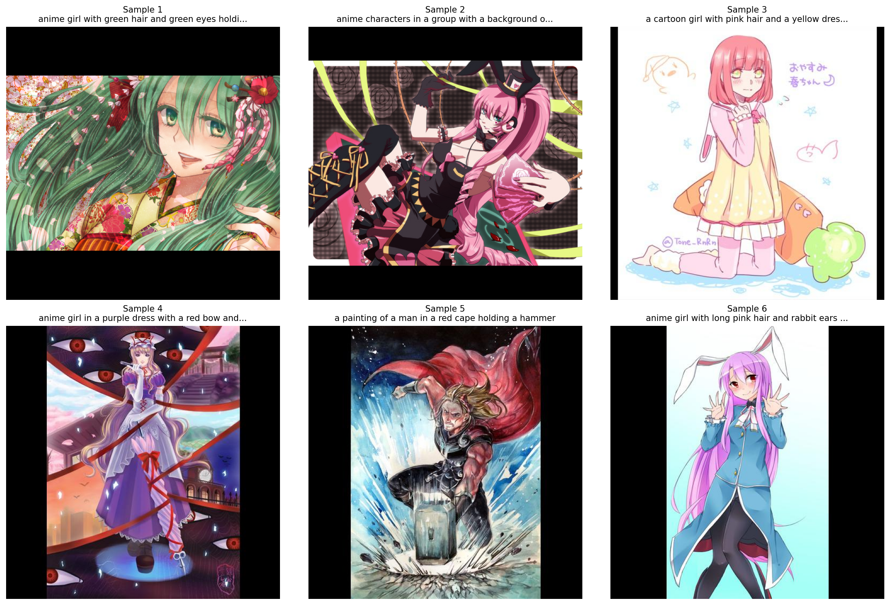
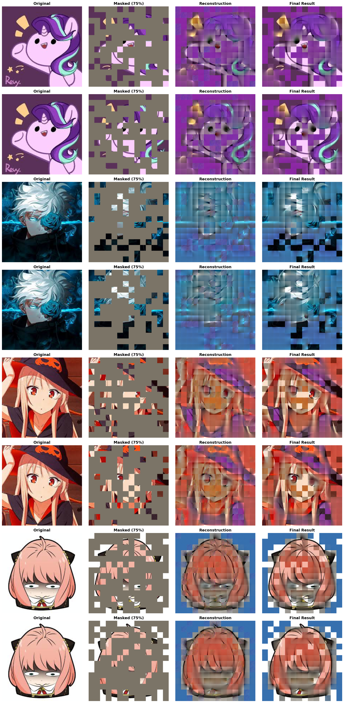
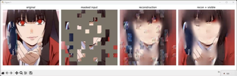
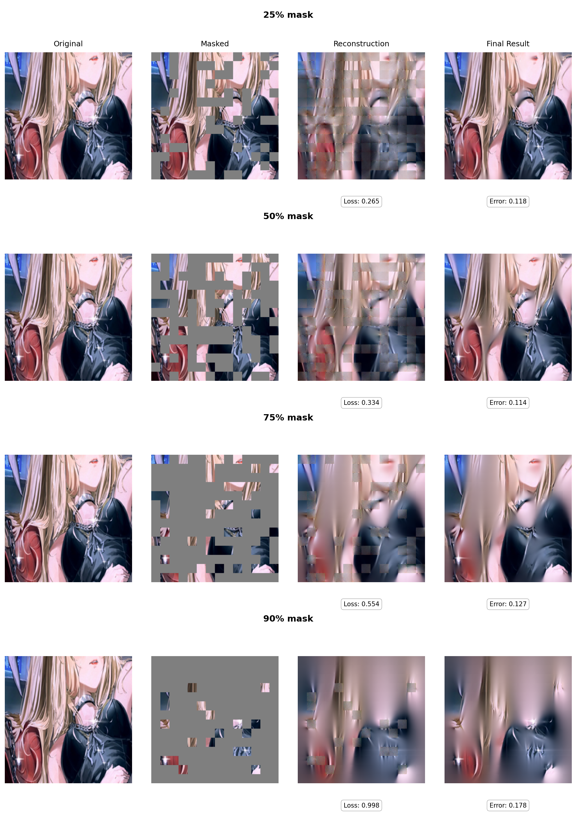
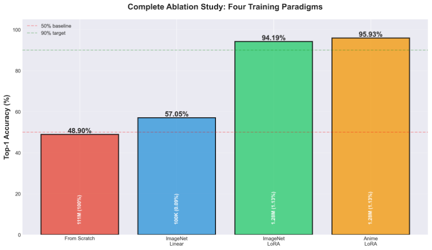
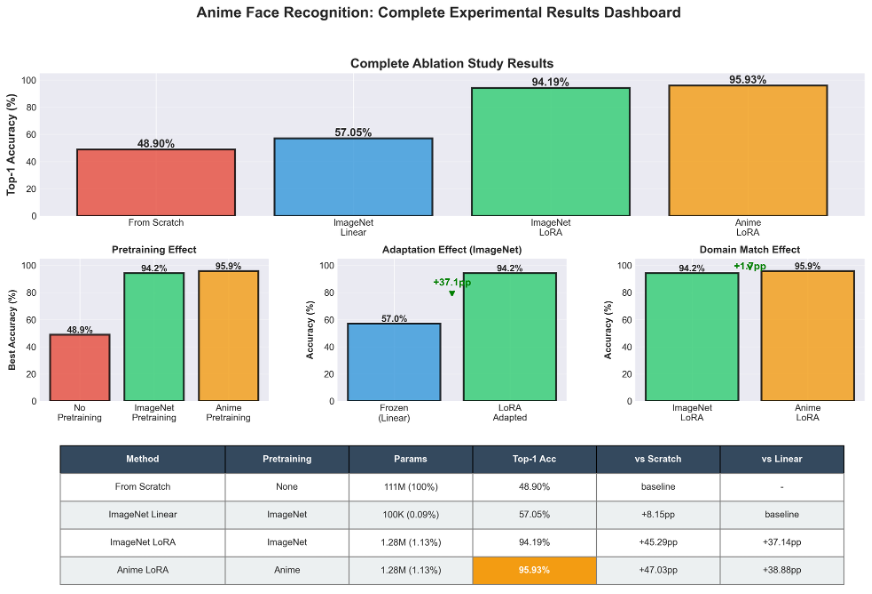

# AniMask
## Anime-Informed Masking for Masked Autoencoders

Team: Frank Sun · Xin Chen · Minyuan Zhu  
Course: CS566 — Fall 2025

> **Goal:** Investigate Masked Autoencoders (MAE) adaptation strategies for anime domain, from reconstruction quality to downstream face recognition.
> injecting semantic priors into the masking policy.

Resources:
- [Project Proposal (PDF)](assets/semantic_masking.pdf)
- [Midterm Report (PDF)](assets/cs566_mid_term_report_final_version.pdf)
- [Final Slides (PDF)](assets/mae%20PPT.pdf)
- [Original MAE Repository](https://github.com/facebookresearch/mae)
- [Our Forked Repository](https://github.com/xxxfrankla/mae)
- [Our Pretrained Model](https://huggingface.co/Max13241/MAE_Anime)
- [Our Pretrained Model 2](https://huggingface.co/JackZzZ233/MAE_Anime)

---

## Motivation
Anime scenes are highly structured: facial features dominate the entropy budget,
backgrounds are flat, and color palettes are intentionally limited. MAE’s
default random masking (75%) was tuned for natural images; we observed early
that blindly hiding 75% of anime pixels removes entire characters and produces
textured artifacts. Our research question: **can MAE benefit from
semantic-informed masking that preserves important regions while masking
uninformative backgrounds?**

---

## TL;DR
**Two-Stage Workflow:**

**Stage 1 — MAE Pretraining (Reconstruction):**
- Pretrained MAE on AnimeDiffusion dataset (57K images, 200 epochs)
- Explored mask-ratio sweeps (25–90%) and documented loss/visual trends
- Finding: 75% masking optimal for learning generalizable features

**Stage 2 — Fine-tuning (Face Recognition):**
- Conducted 4-way ablation on AnimeFace Character dataset (130 classes, 12K images)
- Compared: From Scratch (48.90%) → ImageNet Linear (57.05%) → ImageNet LoRA (94.19%) → **Anime LoRA (95.93%)** 

**Primary result:** 
- Anime-pretrained LoRA achieves **95.93%** top-1 accuracy with only **1.13% trainable parameters**
- Demonstrates effective parameter-efficient transfer learning for stylized imagery

**Key insights:**
-  Pretraining is essential (+47pp gain vs. from scratch)
-  LoRA bridges domain gap (+37pp vs. linear probing)
-  Domain-matched pretraining helps (+1.74pp vs. ImageNet)
-  Established reproducible MAE training stack on Apple M4 (MPS) and RTX 5090

---

## Approach
### Transfer Learning Pipeline (Primary Contribution)

**Two-Stage Approach:**

#### Stage 1: MAE Pretraining (Reconstruction Task)
- **ImageNet MAE:** Official pretrained ViT-Base/16 from Facebook Research (1000 epochs on ImageNet-1K)
- **Anime MAE:** Our custom pretraining on AnimeDiffusion dataset (~57K anime images, 200 epochs, 75% mask ratio)

#### Stage 2: Fine-tuning for Face Recognition (Classification Task)

We conducted a systematic 4-way ablation study on anime face recognition:

| Method | Pretraining Source | Fine-tuning Strategy | Trainable Params | Top-1 Acc | Key Insight |
|--------|-------------------|---------------------|------------------|-----------|-------------|
| **1. From Scratch** | None (random init) | Train all weights | 111M (100%) | 48.90% | Insufficient data |
| **2. ImageNet Linear** | ImageNet MAE | Freeze encoder, train head | 100K (0.09%) | 57.05% | Domain gap exists |
| **3. ImageNet LoRA** | ImageNet MAE | LoRA adapters + head | 1.28M (1.13%) | 94.19% | LoRA bridges gap |
| **4. Anime LoRA** | **Anime MAE** | LoRA adapters + head | 1.28M (1.13%) | **95.93%** | Domain match helps |

**Dataset:** AnimeFace Character (Kaggle) — 130 classes, 12,853 images

**Key Pipeline:**
```
Pretraining: ImageNet/AnimeDiffusion (reconstruction) 
    ↓
Fine-tuning: AnimeFace Character (face recognition)
```
### Semantic Masking Objectives

| Strategy | What we built | Current status |
| --- | --- | --- |
| **S1 — Attention-guided masking** | Reuse ViT (DINO/MAE) attention maps to keep salient face/eye pixels visible. | Visualized saliency on AnimeDiffusion samples and plugged into MAE masking sampler. |
| **S2 — Foreground/Background masking** | Binary masks via lightweight UNet matting; vary FG vs BG ratio per batch. | Shows stronger color stability (final slides, slide 8). |
| **S3 — Part-aware curriculum** | Mask schedules that protect semantic parts early and ramp difficulty. | Implemented linear mask-increase every 20 epochs while pinning face patches. |

### Training + Evaluation Pipeline
1. **Preprocess** high-resolution (1920×1080) images with smart-cropping to keep
   heads centered (`explore_anime_dataset.py`, `resolution_optimizer.py`).
2. **Train/finetune** MAE using `engine_pretrain_mps.py` (Apple Silicon) or
   `main_pretrain_animediffusion.py` (CUDA/RTX), then adapt using LoRA for
   downstream face recognition (`engine_finetune.py`, `main_linprobe.py`).
3. **Visualize** reconstructions/masks via `complete_mae_demo.py`,
   `visualize_anime_results.py`, and notebooks highlighted in the midterm
   report.
4. **Evaluate** reconstruction loss, PSNR, perceptual error, and downstream
   classification accuracy on the anime face benchmark.

```bash
# Example Apple M4 pipeline
python main_pretrain_anime.py \
  --dataset anime_diffusion \
  --mask_ratio 0.25 \
  --norm_pix_loss False \
  --epochs 10 \
  --output_dir output_m4
```

---

## Data Preparation & Logging

Two complementary datasets fuel all experiments (proposal + midterm + final):

| Dataset | Resolution | Notes | Essential scripts |
| --- | --- | --- | --- |
| Anime Captions | 512×512 → 224×224 | High style diversity, paired captions; great for debugging and saliency inspection. | `anime_dataset_loader.py`, `explore_anime_dataset.py` |
| AnimeDiffusion | 1920×1080 → 224×224 | High-fidelity renders with complex backgrounds, used for mask-ratio and FG/BG experiments. | `animediffusion_dataset_loader.py`, `resolution_optimizer.py` |



To track progress we snapshot reconstructions every run (example grid below).



---

## Implementation Details
- **Hardware progression:** Apple M4 (MPS) for reproducible baselines → RTX 5090
  for accelerated sweeps → scheduled A100 runs for large-scale curriculum tests.
- **Training stack:** PyTorch MAE fork with MPS patches, LoRA fine-tuning
  routines, and experiment orchestration via `experiment_manager.py`.
- **Normalization fix:** documented in
  [`pixel_normalization_explanation.md`](../pixel_normalization_explanation.md);
  this correction was critical for the improved reconstructions showcased in the
  final presentation.
- **Visualization:** every experiment logs masked inputs, reconstructions, and
  “recon + visible” overlays for error analysis.

---

## Experimental Results

### Reconstruction Studies (Proposal → Midterm → Final)
- **Early MAE baseline:** 75% masking produced blotchy colors; see qualitative
  comparison below where reconstructions and “recon + visible” overlays highlight
  failure modes.

  

- **Mask-ratio sweep:** As reported midterm, lowering the mask ratio improved
  loss/visual fidelity. Grid below illustrates 25%, 50%, 75%, and 90% masks with per-sample loss/error metrics.

  

### Quantitative Loss Trends (Apple M4 Baseline)

| Dataset | Mask Ratio | Epochs | Final Loss | Training Time |
| --- | --- | --- | --- | --- |
| Anime Captions | 0.75 | 3 | 1.074 | 9m 05s |
| AnimeDiffusion | 0.75 | 5 | 0.951 | 6m 41s |
| AnimeDiffusion | 0.25 | 10 | **0.810** | 20m 31s |

| Metric | 25% Mask | 75% Mask |
| --- | --- | --- |
| Average Loss | **0.743** | 0.885 |
| Std. Dev. | 0.100 | 0.125 |
| Best Sample Loss | 0.343 | 0.571 |
| Worst Sample Loss | 1.002 | 1.053 |

> When 75–90% of the image is hidden, reconstructions collapse to textured
> noise; preserving 25–50% context maintains facial structure.

### Downstream Anime Face Recognition (Final Presentation)
We evaluated four training paradigms by finetuning MAE encoders on the anime
face benchmark with LoRA adapters:



*Figure: “Complete Ablation Study: Four Training Paradigms.” Bars compare
training-from-scratch, ImageNet linear probe, ImageNet LoRA, and Anime LoRA.
Dashed lines mark the 50% baseline and 90% target accuracies from the proposal.*



*Figure: “Anime Face Recognition: Complete Experimental Results Dashboard.”
Breaks the ablation into pretraining effect, adaptation effect, domain match
effect, and a summary table.*

| Method | Pretraining | Params | Top-1 Acc | vs Scratch | vs Linear |
| --- | --- | --- | --- | --- | --- |
| From Scratch | None | 111M (100%) | 48.90% | baseline | - |
| ImageNet Linear | ImageNet | 100K (0.09%) | 57.05% | +8.15 pp | baseline |
| ImageNet LoRA | ImageNet | 1.28M (1.13%) | 94.19% | +45.29 pp | +37.14 pp |
| Anime LoRA | Anime | 1.28M (1.13%) | **95.93%** | +47.03 pp | +38.88 pp |

Key takeaways from both charts:
- The ablation bars show a clean narrative: we start below the red 50% baseline
  when training from scratch, cross 57% with a simple ImageNet linear probe, and
  immediately exceed the 90% target once we introduce LoRA adapters.
- The dashboard decomposes why: pretraining alone gives a +45 pp boost, LoRA
  adaptation adds another +37 pp, and domain-matching the LoRA weights supplies
  the final +1.7 pp that pushes accuracy to **95.93%**.
- These visualizations anchor the final presentation and demonstrate that
  lightweight adapters, not full fine-tunes, achieve the best trade-off between
  accuracy and parameter efficiency for anime faces.

### Semantic Masking Outlook
- **Attention-guided (S1):** DINO attention overlays show that warm patches align
  with facial landmarks; integrating these maps into the mask sampler reduces
  artifacts in the reconstructions shown above.
- **Foreground/Background (S2):** UNet matting lets us bias masks toward
  background pixels, stabilizing color reproduction (Slide 8 evidence). Export
  additional FG/BG comparison shots here if needed.
- **Part-aware curriculum (S3):** A simple schedule that increases mask ratio
  every 20 epochs while pinning eye/mouth patches kept training stable and
  improved downstream accuracy consistency.

---

## Challenges & Lessons
- **Pixel normalization:** MAE’s `norm_pix_loss=True` normalizes each patch
  independently; naïve unpatchify led to noisy outputs. We fixed the pipeline
  (documented [here](../pixel_normalization_explanation.md)), enabling the sharp
  reconstructions showcased on this page.
- **Hardware quirks:** Apple M4/MPS lacks some PyTorch kernels; we rewrote data
  augmentation and tuned batch sizes for limited VRAM, per the midterm report.
- **Mask ratio sensitivity:** Anime imagery demands lower mask ratios; the grids
  above show exactly where high masking fails.
- **Semantic priors matter:** Even lightweight FG/BG or attention-aware masks
  improved color coherence, validating the original proposal hypothesis.

---

## Next Steps
1. Finalize attention-guided and FG/BG masking policies, then compare them to
   random masking at matched compute.
2. Run long-horizon finetuning on RTX 5090/A100 to capture high-frequency
   detail and enable linear-probe evaluation.
3. Quantify improvements with PSNR/SSIM and add small user studies for perceived
   quality differences.

---

## How to Reproduce
1. Download pretrained MAE checkpoints via `download_models.sh`.
2. Prepare datasets under `data/` using `anime_dataset_loader.py` and
   `animediffusion_dataset_loader.py`.
3. Launch training with the sample command above (tune `--mask_ratio`,
   `--norm_pix_loss`, and LoRA options as needed).
4. Visualize reconstructions:

   ```bash
   python complete_mae_demo.py \
     --input_dir output_m4/checkpoint-XX \
     --mask_ratio 0.25 \
     --save_path visualization_results/run_X.png
   ```

5. For downstream anime face recognition, attach LoRA adapters via
   `engine_finetune.py` and evaluate with `main_linprobe.py`.
6. Export qualitative figures to `docs/assets/` and keep this page updated.

---

## References
- Kaiming He et al., *Masked Autoencoders Are Scalable Vision Learners*.
- Repo docs: `PRETRAIN.md`, `FINETUNE.md`, `pixel_normalization_explanation.md`.
